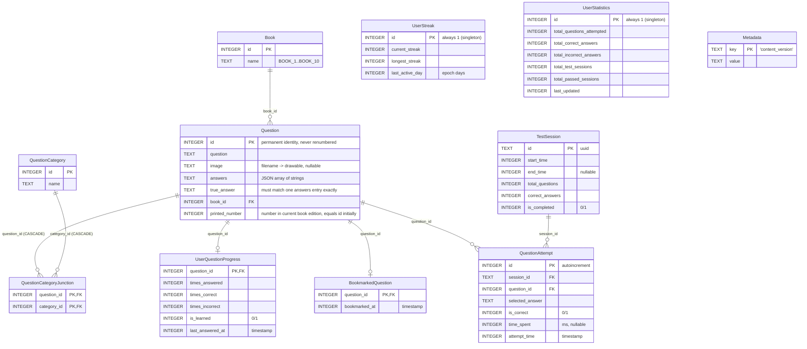
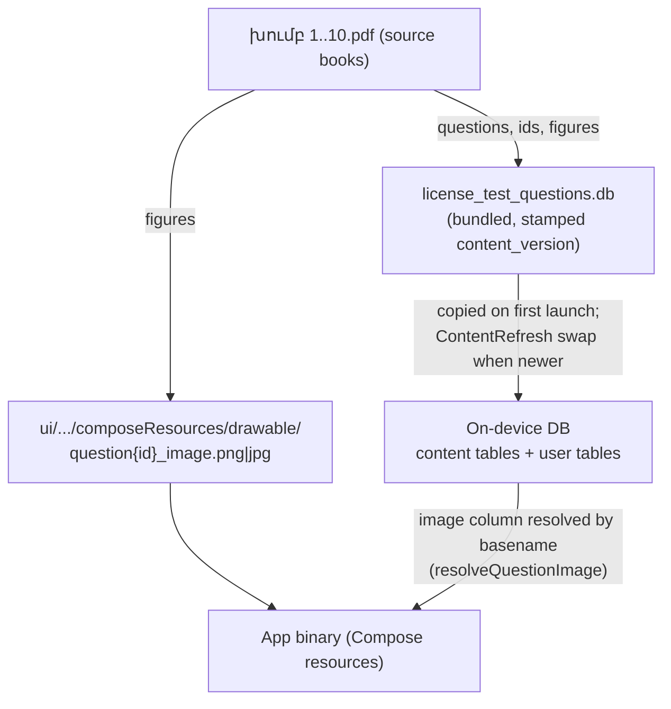

# Database — Structure & Lifecycle

The app ships a pre-populated SQLite database (`database/src/commonMain/resources/license_test_questions.db`) built from the 10 official Armenian question books (`խումբ 1..10.pdf`). On first launch it is copied to the device; from then on the on-device copy is the single database, holding both question content and the user's progress. Content updates are applied in place by `ContentRefresh` (see below), never by overwriting the file.

## Entity relations



`UserStreak`, `UserStatistics`, and `Metadata` are standalone single-row/key-value tables with no foreign keys. `BookmarkedQuestion` and `UserStreak` are not in the bundled file; `ensureMissingTables` creates them on the device. The bundled file also contains a legacy `Category` table that nothing references.

## Table ownership

| Group | Tables | On content update |
|---|---|---|
| Content (ours) | `Book`, `Question`, `QuestionCategory`, `QuestionCategoryJunction`, `Metadata` | Replaced wholesale from the new bundle |
| User data (theirs) | `UserQuestionProgress`, `BookmarkedQuestion`, `QuestionAttempt`, `TestSession`, `UserStreak`, `UserStatistics` | Preserved; rows pointing at removed questions are deleted |

## id vs printed_number

- `Question.id` is the question's **permanent identity**. Progress, bookmarks, attempts, and image filenames (`question{id}_image.*`) all key on it. Never renumber, never reuse a removed id.
- `Question.printed_number` is where the question sits in the **current edition** of the physical book, unique per book only. It starts equal to `id`; if a future edition renumbers questions, update `printed_number` and leave `id` alone. Look up a question in the book via `book_id` + `printed_number` (`selectByPrintedNumber`).

## Resources around the database



Images are **not** stored in the database. `Question.image` holds a filename; the pixels are Compose drawables compiled into the app binary and resolved at runtime by basename. Adding or removing questions means adding or removing drawable files together with the DB rows.

## Startup flow (both platforms, in `DatabaseDriverFactory`)

1. If no DB file exists on the device, copy the bundled one (first launch only; never overwrite).
2. Open the driver; `ensureMissingTables` creates `UserStreak`, `BookmarkedQuestion`, `Metadata` if absent.
3. `ContentRefresh`: if the installed DB's `content_version` is older than `ContentRefresh.CONTENT_VERSION`, ATTACH the bundled DB, swap the content tables in one transaction, delete orphaned progress/bookmark/attempt rows, stamp the new version.

## Updating question content

Follow the checklist in `APP_ROADMAP.md` Phase 10. In short: edit the bundled DB keeping ids permanent, add/remove `question{id}_image.*` drawables, then run:

```
python3 scripts/verify_questions.py     # content matches the source PDFs
python3 scripts/verify_image_refs.py    # DB <-> drawable consistency
python3 scripts/set_content_version.py <n+1>
```

and set `ContentRefresh.CONTENT_VERSION` to the same number, all in one commit. User tables in the bundled DB must stay empty.
